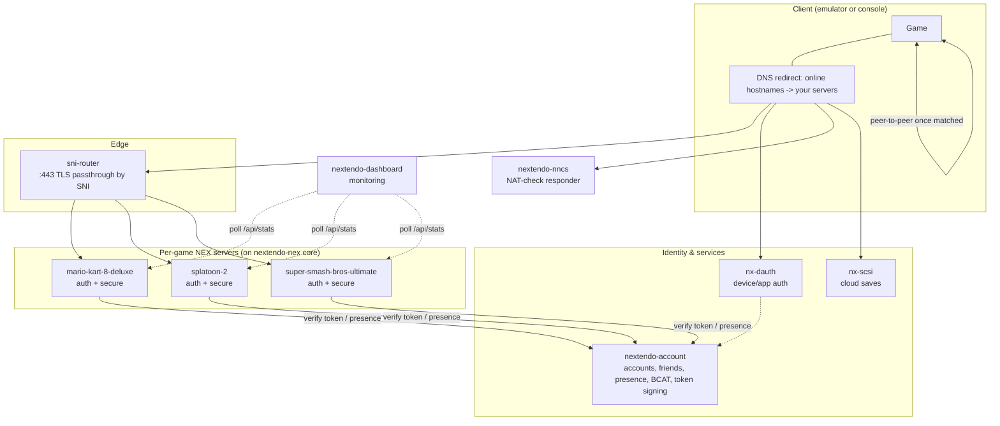

# Architecture

Nextendo Network reimplements the **server** side of a console's online stack. The **client** is an
unmodified game running on the Nextendo emulator (or a real console), which is pointed at these
servers by DNS. The client believes it is talking to the retail service; the servers answer with the
same protocols.

## Components

### The core — `nextendo-nex`
A from-scratch Go implementation of the NEX / PRUDP middleware: the reliable-UDP transport, the RMC
message layer, Kerberos-style ticket authentication, and the common service protocols (matchmaking,
ranking, NAT traversal, utility). The game servers are thin programs built on top of it.

### The game servers
Each supported game has its own repository. A single process runs **both** endpoints the game needs:

- **auth** (`:443`) — TicketGranting. `LoginEx` validates the account and issues a Kerberos ticket.
- **secure** — SecureConnection + matchmaking + NAT traversal + ranking, on a per-game port.

(Note: unlike some other projects that split auth and secure into two separate services, the Nextendo
game server runs them together in one binary — which is why each game is a single flat repository
rather than a meta-repository of submodules.)

### `sni-router`
The auth endpoints of every game all want to live on `:443`. The router peeks the TLS ClientHello,
reads the SNI hostname, and forwards the raw (still-encrypted) stream to the right game's auth server,
which terminates TLS itself. This lets all games share one `:443`.

### `nextendo-account`
The identity hub. It:
- issues and validates the account tokens the game servers trust (the `nx2.` NEX login token);
- stores accounts, the friend graph, and online presence shared across every game;
- serves the BCAT schedule/data cache some titles download;
- exposes public `/api/*` routes (used by the website) and private `/internal/*` control-plane routes
  (used only by the other services on the internal network).

### `nx-dauth`
Serves the device/application authentication chain a console performs before anything else,
self-signing every token so no external authority is involved.

### `nextendo-nncs`
Some games run their peer-to-peer sessions through a NAT-detection step (a Pia "NAT-check"). This tiny
UDP responder answers that probe with the client's observed public address so hole-punching can
proceed. It listens on two logically-distinct addresses because the NAT check compares two vantage
points — see [DEPLOYMENT.md](DEPLOYMENT.md).

### `nx-scsi`, `nextendo-dashboard`
Optional: cloud saves, and a live monitoring aggregator that polls each game server's stats.

## What happens when a game goes online

1. **DNS redirect.** The client resolves the service's online hostnames; the emulator's DNS layer (or
   your DNS) points them at your servers instead of the retail ones.
2. **Device auth.** The client runs its device/application authentication against `nx-dauth`, which
   self-signs the tokens.
3. **Account token.** The client presents a locally-signed account identity; `nextendo-account`
   issues the `nx2.` NEX login token that the game servers will trust.
4. **NEX auth.** The client opens a TLS connection to `:443`; `sni-router` forwards it to the game's
   auth server, which validates the token in `LoginEx` and returns a Kerberos ticket + the address of
   the secure server.
5. **Secure + matchmaking.** The client connects to the secure server with its ticket and enters
   matchmaking. Presence is reported to `nextendo-account` so friends can see each other.
6. **NAT check + P2P.** For peer-to-peer titles, the client runs the NAT check against
   `nextendo-nncs`, learns its external address, and hole-punches directly to the other players. The
   servers are out of the loop for actual gameplay traffic.

## Trust & security boundaries

- **Tokens, not shared state.** Every service derives the same identity from the account's ID, so they
  agree without a shared database. The signing secret is the only thing that must match between the
  account server and the game servers — supplied via environment.
- **`/internal/*` is not public.** Control-plane routes are gated in the application layer by the real
  TCP source address plus a shared internal key; they must never be exposed to the internet.
- **Nothing is hardcoded.** Addresses, ports, keys, and the TLS material all come from configuration.
